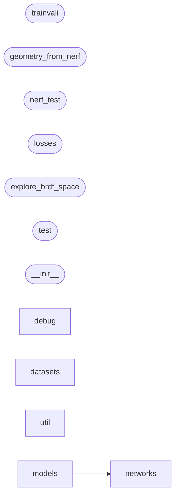

# Code Overview

[_Documentation generated by Documatic_](https://www.documatic.com)

<!---Documatic-section-Codebase Structure Python-start--->
## Codebase Structure Python

The codebase has a single-depth folder structure,
                with 38 code files in total.

<!---Documatic-block-system_architecture-start--->

<!---Documatic-block-system_architecture-end--->

# #
<!---Documatic-section-Codebase Structure Python-end--->

<!---Documatic-section-File IO-start--->
## File IO

<!---Documatic-block-file_io-start--->
The following files have file read operations

<!---Documatic-block-nerfactor.datasets-start--->

	
<code>nerfactor.datasets</code> (Click to Expand!)

* nerfactor.datasets.mvs_shape
* nerfactor.datasets.nerf
* nerfactor.datasets.nerf_shape

<!---Documatic-block-nerfactor.datasets-end--->

<!---Documatic-block-nerfactor.models-start--->

	
<code>nerfactor.models</code> (Click to Expand!)

* nerfactor.models.brdf
* nerfactor.models.nerf
* nerfactor.models.nerfactor
* nerfactor.models.shape

<!---Documatic-block-nerfactor.models-end--->

<!---Documatic-block-nerfactor.util-start--->

	
<code>nerfactor.util</code> (Click to Expand!)

* nerfactor.util.io
* nerfactor.util.vis

<!---Documatic-block-nerfactor.util-end--->

The following files have file write operations

<!---Documatic-block-nerfactor.util-start--->

	
<code>nerfactor.util</code> (Click to Expand!)

* nerfactor.util.geom
* nerfactor.util.io

<!---Documatic-block-nerfactor.util-end--->
<!---Documatic-block-file_io-end--->

# #
<!---Documatic-section-File IO-end--->

<!---Documatic-section-Class Hierarchy-start--->
## Class Hierarchy

<!---Documatic-block-BaseDataset-start--->

	
<code>BaseDataset</code> (Click to Expand!)

* nerfactor.datasets.brdf_merl.Dataset
* nerfactor.datasets.mvs_shape.Dataset
* nerfactor.datasets.nerf.Dataset
* nerfactor.datasets.nerf_shape.Dataset

<!---Documatic-block-BaseDataset-end--->

<!---Documatic-block-BaseModel-start--->

	
<code>BaseModel</code> (Click to Expand!)

* nerfactor.models.brdf.Model
* nerfactor.models.nerf.Model
* nerfactor.models.shape.Model

<!---Documatic-block-BaseModel-end--->

<!---Documatic-block-BaseNetwork-start--->

	
<code>BaseNetwork</code> (Click to Expand!)

* nerfactor.networks.mlp.Network
* nerfactor.networks.seq.Network

<!---Documatic-block-BaseNetwork-end--->

<!---Documatic-block-keras.layers.Layer-start--->

	
<code>keras.layers.Layer</code> (Click to Expand!)

* nerfactor.networks.layers.LatentCode

<!---Documatic-block-keras.layers.Layer-end--->

# #
<!---Documatic-section-Class Hierarchy-end--->

[_Documentation generated by Documatic_](https://www.documatic.com)